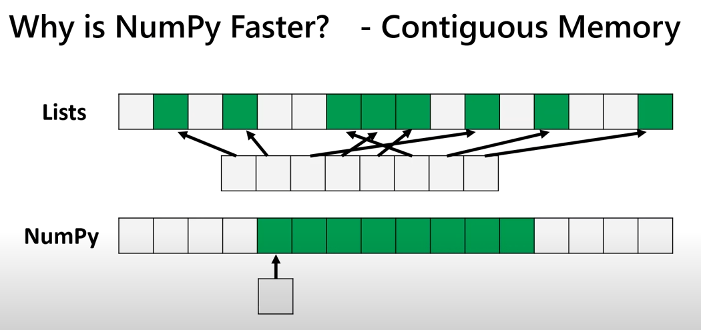

### How are the Lists different from Numpy?

1. Speed:
   - Lists are slow (built-in type with lot more information, for Lists it has Size, Reference Count, Object Type, Object Value ),
   - Numpy are fast
     - one of the reason is Numpy uses fixed type, hence faster to read less bytes of memory)
     - no type checking when iterating through objects
     - contiguous memory: utilize cpu SIMD Vector Processing, and Effective Cache Utilization
       
2. functionality:
   - Lists can do insertion, deletion, appending, concatenation, etc.
   - Numpy can do the same, and lots more.

### The basics

```py
import numpy as np
import sys

# Create an array.
# numpy.array(object, dtype=None, *, copy=True, order='K', subok=False, ndmin=0, like=None)
a = np.array([1, 2, 3], dtype="int8")

# [1 2 3]
print(a)

# 2 dimensions
b = np.array([[1.0, 2.0, 3.0], [4.0, 5.0, 6.0]])

# [[1. 2. 3.]
# [4. 5. 6.]]
print(b)

# Get dimension of array
# Dimension 1 2
print("Dimension", a.ndim, b.ndim)

# Get shape of array
# Shape (3,) (2, 3), because a is 1 dimensional, b has 2 rows and 3 cols
print("Shape", a.shape, b.shape)

# Get Type/Size
# Type int8 size 1 byte
print("Type", a.dtype, "size", a.itemsize)

# Type float64, size 8 bytes
print("Type", b.dtype, "size", b.itemsize)

# Get total size (how many elements in total)
# size 3
print("size", a.size)
# size 6
print("size", b.size)

# Get total itemsize (how big the elements in total)
# size 3
print("size", a.nbytes)
# size 48, because float is 8 bytes
print("size", b.nbytes)
```

#### Accessing/Changing specific elements, rows, columns, etc

```py
import numpy as np
import sys

# a 2 by 7 array
a = np.array([[1, 2, 3, 4, 5, 6, 7], [8, 9, 10, 11, 12, 13, 14]])

# (2, 7)
print(a.shape)

# Get a specific element [r, c], meaning [rowIndex, columnIndex]
# 13, the second row, sixth column
print(a[1, 5])

# Select from right
# 13, the second row, second from right
print(a[1, -2])

# Get a specific row
# [1 2 3 4 5 6 7]
print(a[0])

# Get a specific row
# [1 2 3 4 5 6 7]
print(a[0, :])

# Get a specific column
# [ 7 14]
print(a[:, -1])  # to get last column

# Get a block
"""
[ 7 14]
[[6 7]]
"""
print(a[:1, 5:])  # up to 2nd row, and from the sixth column

# Get a block, with steps
"""
[[ 1  3  5]
 [ 8 10 12]]
"""
print(
    a[:, :5:2]
)  # all rows, starts from the first column, ends at the sixth column, with step of 2.


# Changing value is straight forward
a[1, 5] = 2000
"""
[[   1    2    3    4    5    6    7]
 [   8    9   10   11   12 2000   14]]
"""
print(a)

# change entire row
"""
[[   5    5    5    5    5    5    5]
 [   8    9   10   11   12 2000   14]]
"""
a[0, :] = 5
print(a)

```

### Initial arrays in numpy

```py
import numpy as np
import sys

# init array with 0s
"""
[[0. 0. 0.]
 [0. 0. 0.]]
"""
a = np.zeros((2, 3))
print(a)

# init array with 1s
"""
[[1 1]
 [1 1]
 [1 1]
 [1 1]]
"""
a = np.ones((4, 2), dtype="int8")
print(a)

# init array with any number
"""
[[99 99 99]
 [99 99 99]]
"""
a = np.full((2, 3), 99)
print(a)

# init array with any number, using the shape of an existing np array
b = np.array([[1, 2, 3, 4, 5], [6, 7, 8, 9, 10]])
# (2, 5)
print(b.shape)
"""
[[100 100 100 100 100]
 [100 100 100 100 100]]
"""
a = np.full(b.shape, 100)
print(a)

# init array with random decimal numbers
"""
[[0.78049648 0.26356169]
 [0.46088537 0.92474463]
 [0.15290645 0.61598542]
 [0.03420792 0.784052  ]]
"""
a = np.random.rand(4, 2)
print(a)

# init array with random decimal numbers, using the shape of an existing np array
b = np.array([[1, 2, 3, 4, 5], [6, 7, 8, 9, 10]])
"""
[[0.87825252 0.72141859]
 [0.8723718  0.76555121]
 [0.33980731 0.72665856]
 [0.43332843 0.00246865]]
"""
a = np.random.random_sample(a.shape)
print(a)

# random integer values, between the range 4-7 (include 4 but exclude 7)
"""
[[4 4 6]
 [6 4 6]
 [5 6 4]]
"""
a = np.random.randint(4, 7, size=(3, 3))
print(a)


# repeat an existing np array
b = np.array([[1, 2, 3]])
"""
[1 1 1 2 2 2 3 3 3]
"""
a = np.repeat(b, 3)
print(a)

# “axis 0” represents rows and “axis 1” represents columns.
"""
[[1 2 3]
 [1 2 3]
 [1 2 3]]
"""
a = np.repeat(b, 3, axis=0)  # repeat along row direction
print(a)

"""
[[1 1 1 2 2 2 3 3 3]]
"""
a = np.repeat(b, 3, axis=1)  # repeat along column direction
print(a)


# quiz

init = np.full((5, 5), 1)
"""
[[1 1 1 1 1]
 [1 1 1 1 1]
 [1 1 1 1 1]
 [1 1 1 1 1]
 [1 1 1 1 1]]
"""
print(init)

inner = np.full((3, 3), 0)
"""
[[0 0 0]
 [0 0 0]
 [0 0 0]]
"""
print(inner)

inner[1, 1] = 9
"""
[[0 0 0]
 [0 9 0]
 [0 0 0]]
"""
print(inner)

init[1:-1, 1:-1] = inner
"""
[[1 1 1 1 1]
 [1 0 0 0 1]
 [1 0 9 0 1]
 [1 0 0 0 1]
 [1 1 1 1 1]]
"""
print(init)

### Be careful when copying arrays!!!
a = np.array([1, 2, 3])
b = a  # a direct copy

# to make a new copy, using copy function
c = a.copy()

b[0] = 100  # you though you are changing the value in b
c[-1] = 200  # c will NOT have the same issue

# [100   2   3]
print(a)  # but value in a also changed

```

### Mathematics

```py
import numpy as np
import sys

a = np.array([1, 2, 3, 4])

a = a + 2

# [3 4 5 6]
print(a)

a -= 3
# [0 1 2 3]
print(a)

a *= 20
# [ 0 20 40 60]
print(a)

a = a / 10
# [0. 2. 4. 6.]
print(a)

a = np.sin(a)
# [ 0.          0.90929743 -0.7568025  -0.2794155 ]
print(a)

a = np.cos(a)
# [1.         0.61430028 0.72703513 0.9612168 ]
print(a)

# math on 2 np arrays
a = np.array([1, 2, 3, 4])
b = np.array([5, 6, 7, 8])

# [ 6  8 10 12]
print(a + b)

# But you can do math on 2 np arrays with different shapes
# ValueError: operands could not be broadcast together with shapes (4,) (3,)
a = np.array([1, 2, 3, 4])
b = np.array([5, 6, 7])
# print(a + b)

```

### Linear Algebra

```py
import numpy as np
import sys

a = np.ones((2, 3))
"""
[[1. 1. 1.]
 [1. 1. 1.]]
"""
print(a)

b = np.full((3, 2), 2)
"""
[[2 2]
 [2 2]
 [2 2]]
"""
print(b)
# np has matrix multiply function
c = np.matmul(a, b)
"""
[[6. 6.]
 [6. 6.]]
"""
print(c)

# Find the determinant
d = np.identity(3)
# 1.0
print(np.linalg.det(d))

```

### Statistics

```py
import numpy as np
import sys

stats = np.array([[1, 2, 3], [4, 5, 6]])
"""
[[1 2 3]
 [4 5 6]]
"""
print(stats)
# 1
print(np.min(stats))
# [1 2 3], because row [1,2,3] < row [4,5,6]
print(np.min(stats, axis=0))  # get min on row basis
# [1 4], because in the 2 arrays, the min values are [1, 4]
print(np.min(stats, axis=1))  # get min on column basis

# 6
print(np.max(stats))

# 3.5
print(np.mean(stats))

# 21
print(np.sum(stats))
# [5 7 9]
print(np.sum(stats, axis=0))
# [ 6 15]
print(np.sum(stats, axis=1))
```

### Reorganizing Arrays (reshape, vstack, hstack)

```py
import numpy as np
import sys

before = np.array([[1, 2, 3, 4], [5, 6, 7, 8]])

# before is (2,4), we want to reshape it to (4,2)
"""
[[1 2]
 [3 4]
 [5 6]
 [7 8]]
"""
after = before.reshape((4, 2))
print(after)

# vstack - vertically stack arrays
v1 = np.array([1, 2, 3, 4])
v2 = np.array([5, 6, 7, 8])
"""
[[1 2 3 4]
 [5 6 7 8]
 [5 6 7 8]
 [1 2 3 4]]
"""
print(np.vstack([v1, v2, v2, v1]))

# hstack - horizontally stack arrays
"""
[[1. 1. 1. 1]
 [1. 1. 1. 1]]
"""
h1 = np.ones((2,4))
"""
[[0. 0.]
 [0. 0.]]
"""
h2 = np.zeros((2,2))
"""
[[1. 1. 1. 1. 0. 0.]
 [1. 1. 1. 1. 0. 0.]]
"""
print(np.hstack([h1, h2]))

```

### Load data in from a file

```py
import numpy as np
import sys

a = np.genfromtxt("./data.csv", delimiter=",")
"""
[[  1.  13.  21.  11. 196.  75.   4.   3.  34.   6.   7.   8.   0.   1.
    2.   3.   4.   5.]
 [  3.  42.  12.  33. 766.  75.   4.  55.   6.   4.   3.   4.   5.   6.
    7.   0.  11.  12.]
 [  1.  22.  33.  11. 999.  11.   2.   1.  78.   0.   1.   2.   9.   8.
    7.   1.  76.  88.]]
"""
print(a)

b = a.astype("int8")
"""
[[  1  13  21  11 -60  75   4   3  34   6   7   8   0   1   2   3   4   5]
 [  3  42  12  33  -2  75   4  55   6   4   3   4   5   6   7   0  11  12]
 [  1  22  33  11 -25  11   2   1  78   0   1   2   9   8   7   1  76  88]]
"""
print(b)

```

### Advanced Indexing and Boolean Masking

```py
import numpy as np
import sys


# you can index with a list in numpy
a = np.array([1, 2, 3, 4, 5])
# [1 3 5]
print(a[[0, 2, 4]])

a = np.genfromtxt("./data.csv", delimiter=",")

"""
[[False False False False  True  True False False False False False False
  False False False False False False]
 [False False False False  True  True False  True False False False False
  False False False False False False]
 [False False False False  True False False False  True False False False
  False False False False  True  True]]
"""
# boolean masking/filtering
print(a > 50)

# advance index to keep any numbers > 50
"""
[196.  75. 766.  75.  55. 999.  78.  76.  88.]
"""
print(a[a > 50])

# multiple conditions
# [75. 75. 55. 78. 76. 88.]
print(a[(a > 50) & (a < 100)])

# Not operator '~'
"""
[  1.  13.  21.  11. 196.   4.   3.  34.   6.   7.   8.   0.   1.   2.
   3.   4.   5.   3.  42.  12.  33. 766.   4.   6.   4.   3.   4.   5.
   6.   7.   0.  11.  12.   1.  22.  33.  11. 999.  11.   2.   1.   0.
   1.   2.   9.   8.   7.   1.]
"""
print(a[~((a > 50) & (a < 100))])

# to check if any lines(rows) has value greater than 50
# [ True  True  True]
print(np.any(a > 50, axis=1))

```
